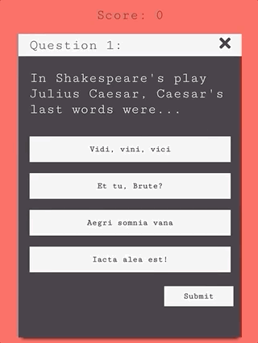
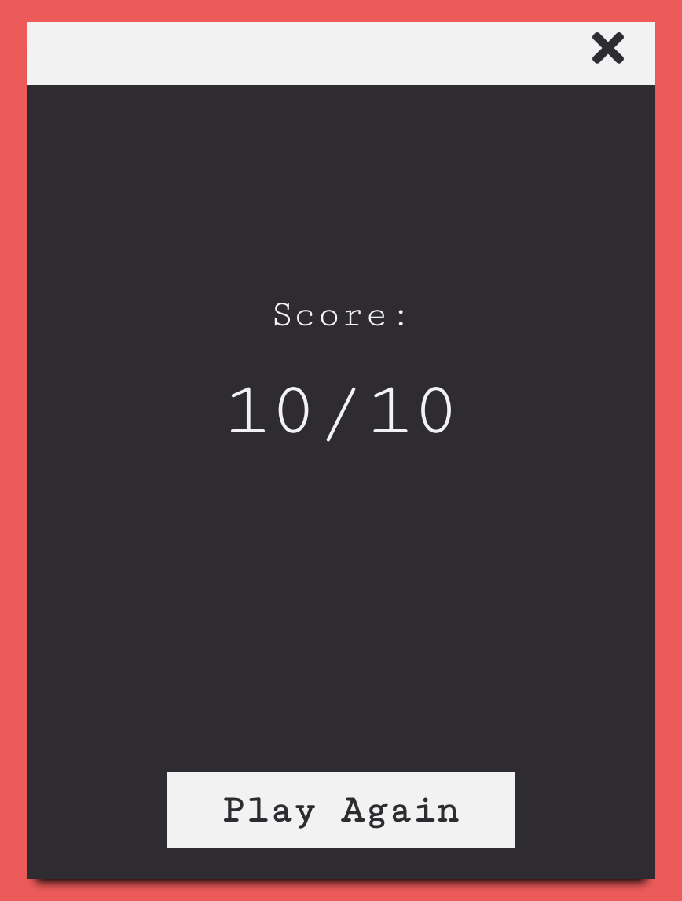

**Play it live [here!](https://triviaknowledge.herokuapp.com/#/)** <br/>
***it's hosted on Heroku, please give it a couple seconds to spin up!

## Description

Test your knowledge and play a round of trivia! Each round consists of 10 questions, see if you can get them all correct. Play as many rounds as you please, every round will be different.

## Table of Contents

- [Technologies](#technologies)
- [Installation](#install)
- [Features](#features)
- [Future Features](#futurePlans)
- [Struggles](#str)

## <a name="technologies"></a>Technologies

- [React](https://reactjs.org/docs/getting-started.html)
- [styled-components](https://styled-components.com/)
- [React Router](https://reactrouter.com/)
- [Heroku](https://heroku.com/)

## <a name="install"></a>Installation

### Steps to get the Flask backend running:

Clone trivia-game repository

```
$ git clone https://github.com/JinaZhu/trivia-game.git
```

Install the frontend dependencies

```
npm install
```

Run the frontend app

```
npm run start
```

## <a name="features"></a>Features

- 10 unique questions are randomly generated for each round
- For each question, the options are shuffled to be in different positions.
- After selection, user is allow to change their mind as long as the submit button is not clicked.
- If no option is selected upon submission, no submission will occur and the options will shake indicating the users to make a selection.
- Upon submitting an answer, the correct answer turns green and the incorrect options turn red and the user's selected option is still highlighted white.
- Score is kept track on top of question card and is updated after every submission.
- Overall score is displayed at the end of the round.
- Replay another round.



## <a name="futurePlans"></a>Future Features

- Allow users to submit questions and add questions to the bank.
- Keep track of the user's highest score.
- Allow users to select difficulty levels.

## <a name="struggles"></a>Struggles

I learned to write tests for the first time with this application by reading documentations and watching tutorials. Originally, functions I created were doing too many tasks, so I broke them down and created helper functions for my component which allowed me to export them for testing. I realized that there are numerous ways of testing functions and components and it's my main focus to learn to write better tests.

Try it out! [PLAY HERE](https://triviaknowledge.herokuapp.com/#/)
